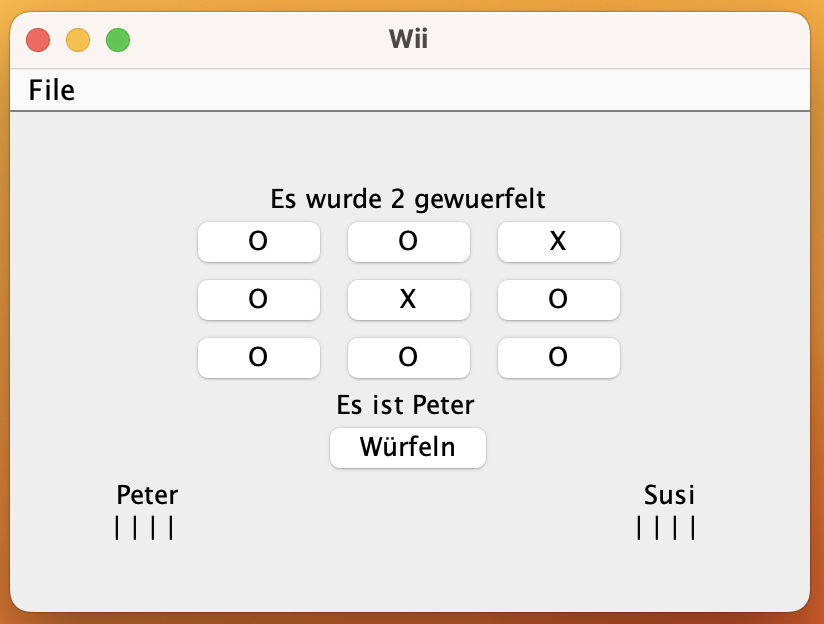
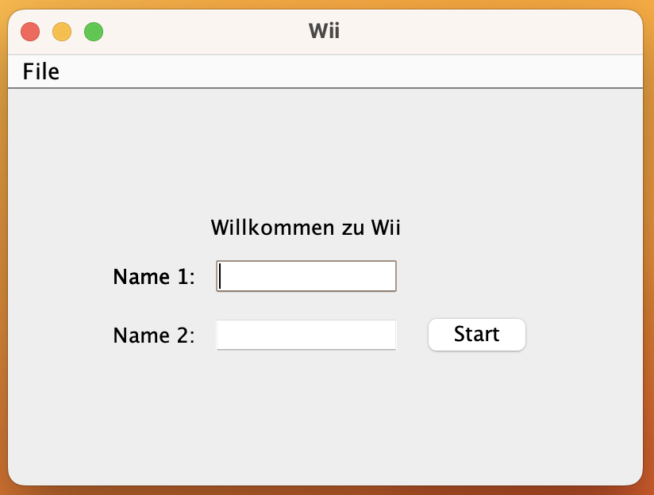
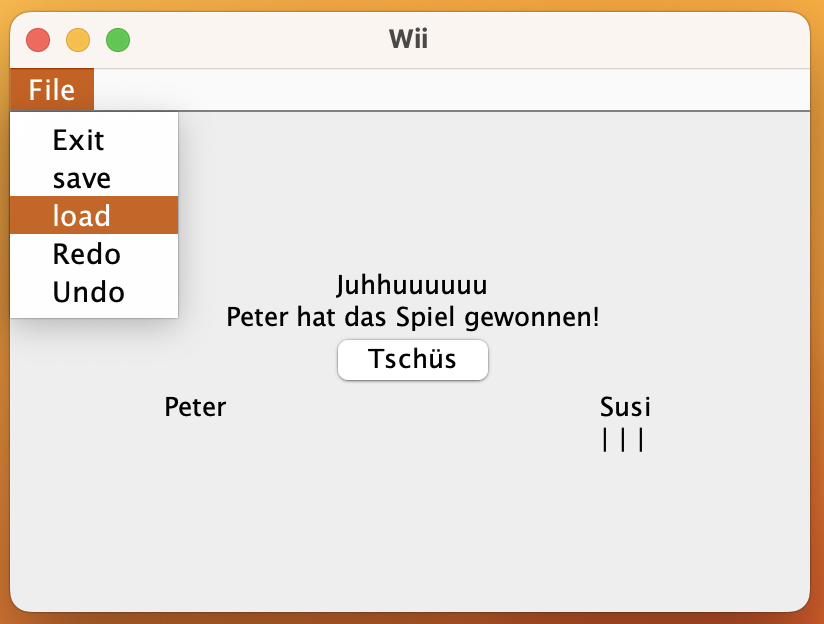

## The Wii-Project compiled with Scala 3

### Usage

This is a normal sbt project. You can compile code with `sbt compile`, run it with `sbt run`, and `sbt console` will start a Scala 3 REPL.

For more information on the sbt-dotty plugin, see the
[scala3-example-project](https://github.com/scala/scala3-example-project/blob/main/README.md).

# Warum immer Ich? - Digital Game

Welcome to the Warum immer Ich? digital game repository! This project aims to recreate the popular German physical game "Warum immer Ich?" in a digital format. With this digital version, players can enjoy the game on their computers or mobile devices without the need for physical game components.

## Table of Contents
- [Game Description](#game-description)
- [Features](#features)
- [Installation](#installation)
- [Usage](#usage)
- [License](#license)

## Game Description
"Warum immer Ich?" (translates to "Why always me?") is a popular German physical board game that involves rolling dice. The game is played by multiple players, each taking turns to roll the dice and moving their pens on the game board. The objective is to reach the end of the own pens before other players.

This project provides a digital version of the "Warum immer Ich?" game, allowing players to experience the game virtually. The digital game retains the core mechanics and rules of the physical version, providing an immersive and engaging gameplay experience.

## Features
- Digital recreation of the "Warum immer Ich?" board game.
- Two-Playermode 
- Intuitive user interface for easy gameplay.
- Randomized dice rolling and movement mechanics.
- Dynamic board size
- Save and load game functionality.
- Do and Undo game functionality.

## Installation
To install and run the digital version of "Warum immer Ich?" on your local machine, follow these steps:

1. Clone the repository to your local machine using the following command:
git clone [https://github.com/your-username/warum-immer-ich.git](https://github.com/willstef95/warum_immer_ich.git)

2. Navigate to the project directory:
open your IDE and run the Game with "scala run"

## Usage
In the first screen you can give your players names.

Then you are ready to go !
Use the "würfeln" button when its your turn and play Wii !

### Options 
You can save, load (last save), do and undo any time.

## License
this Project is complete open. Do what you want

